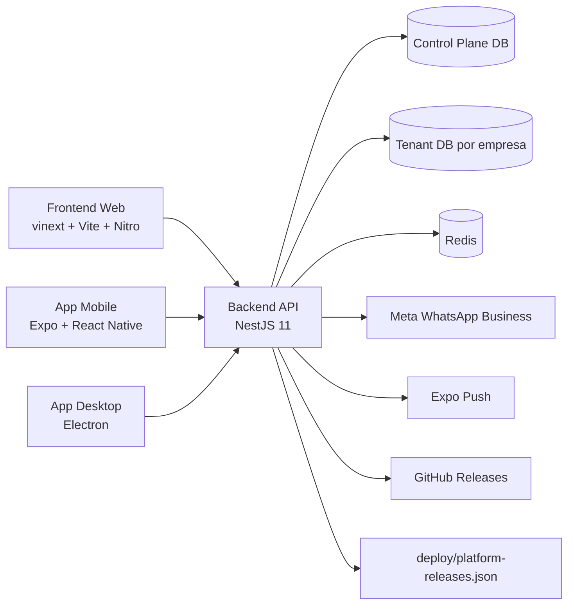
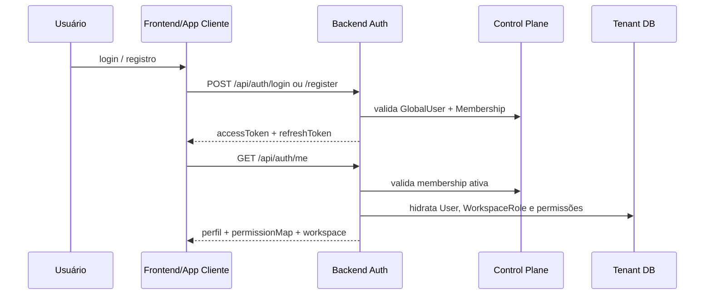

# Arquitetura da Plataforma AutosZap

## 1. Resumo executivo

O AutosZap é um monorepo com quatro superfícies de produto:

- web para operação principal e marketing;
- backend multi-tenant responsável por identidade, dados operacionais, integrações e automações;
- mobile para operação remota;
- desktop para uso contínuo com shell nativo e notificações do sistema operacional.

O desenho central da plataforma é:

- `control plane` para identidade global, empresas, memberships, provisionamento e suporte;
- `tenant database` por empresa para operação diária;
- backend único que resolve o tenant em servidor;
- contratos compartilhados para manter mobile e desktop alinhados com a API.



## 2. Estrutura do monorepo

```text
.
├── apps/
│   ├── desktop/
│   └── mobile/
├── backend/
│   ├── prisma/
│   ├── scripts/
│   └── src/
├── deploy/
├── docs/
├── frontend/
│   ├── app/
│   ├── components/
│   ├── lib/
│   └── store/
├── packages/
│   ├── platform-client/
│   └── platform-types/
├── docker-compose.yml
├── docker-compose.prod.yml
└── package.json
```

## 3. Camadas e responsabilidades

### 3.1 Backend

O backend é o núcleo do sistema. Ele concentra:

- autenticação, refresh token e troca de empresa;
- resolução de tenant;
- dados operacionais do workspace;
- integrações com Meta WhatsApp;
- SSE para inbox e notificações;
- automações de workflow de conversa;
- provisioning de tenant e control plane admin;
- publicação de releases e registro de dispositivos.

Pontos de entrada principais:

- `backend/src/main.ts`
- `backend/src/app.module.ts`
- `backend/src/app.controller.ts`

### 3.2 Frontend web

O frontend usa `app/` e APIs compatíveis com Next, mas o runtime padrão do repositório é vinext sobre Vite/Nitro.

Responsabilidades:

- landing page e captação de interessados;
- autenticação via handlers locais e cookies `httpOnly`;
- shell operacional `/app/*`;
- control plane `/platform/*`;
- proxy server-side para o backend com refresh automático.

Arquivos centrais:

- `frontend/vite.config.ts`
- `frontend/next.config.ts`
- `frontend/proxy.ts`
- `frontend/app/layout.tsx`
- `frontend/app/api/proxy/[...path]/route.ts`
- `frontend/lib/api-client.ts`

### 3.3 Mobile

O app mobile é um cliente operacional relativamente completo.

Responsabilidades:

- login e persistência de sessão;
- inbox e detalhe de conversas;
- CRM, campanhas e notificações;
- telas administrativas de configuração, equipe, instâncias, workflow, pipeline, assistentes e contatos;
- registro de dispositivo para push Expo.

Arquivos centrais:

- `apps/mobile/app/_layout.tsx`
- `apps/mobile/src/providers/session-provider.tsx`
- `apps/mobile/src/lib/api.ts`
- `apps/mobile/src/lib/notifications.ts`

### 3.4 Desktop

O app desktop é híbrido:

- modo principal: shell nativo que abre a versão web;
- fallback: renderer React/Vite local com login, inbox, mensagens, lembretes e notificações.

Arquivos centrais:

- `apps/desktop/electron/main.ts`
- `apps/desktop/electron/preload.ts`
- `apps/desktop/src/App.tsx`

### 3.5 Pacotes compartilhados

- `packages/platform-types`
  Tipos canônicos compartilhados entre backend, mobile e desktop.
- `packages/platform-client`
  SDK HTTP manual com bearer token, refresh automático, métodos por domínio e suporte a SSE.

## 4. Multi-tenancy e autenticação

## 4.1 Modelo

O sistema usa duas camadas de dados:

- `control plane`
  identidade global, empresas, memberships, refresh tokens globais, auditoria, interessados e tickets de suporte;
- `tenant DB`
  dados do workspace: usuários, conversas, contatos, CRM, campanhas, instâncias, notificações e configurações.

## 4.2 Fluxo de autenticação



Características do desenho atual:

- login e refresh são resolvidos no control plane;
- o JWT carrega `globalUserId`, `companyId`, `membershipId`, `workspaceId`, `role` e `platformRole`;
- o frontend web grava `autoszap_access_token` e `autoszap_refresh_token` em cookies `httpOnly`;
- o `frontend/proxy.ts` protege `/app/*` e `/platform/*` e usa o payload do JWT apenas para redirecionamento inicial de UX;
- mobile e desktop persistem `AuthSession` localmente e usam refresh automático no `platform-client`;
- autorização combina papel base, `WorkspaceRole` e overrides de permissões por usuário;
- rotas de plataforma usam `platformRole` (`SUPER_ADMIN` e `SUPPORT`) e rotas tenant exigem membership ativa + tenant resolvido.

## 4.3 Resolução de tenant

O request flow no backend é:

1. `JwtAuthGuard` valida a sessão.
2. `TenantContextGuard` identifica a empresa corrente.
3. `TenantConnectionService` resolve o Prisma client do tenant, com cache e contexto assíncrono.
4. `PrismaService` passa a operar sobre o tenant correto.
5. `RolesGuard`, `PermissionsGuard` e `RateLimitGuard` finalizam a proteção da rota.

## 5. Modelo de dados

## 5.1 Control plane

Modelos principais:

- `GlobalUser`
- `Company`
- `CompanyMembership`
- `TenantDatabase`
- `TenantProvisioningJob`
- `GlobalRefreshToken`
- `GlobalPasswordResetToken`
- `PlatformAuditLog`
- `LeadInterest`
- `CompanyInviteCode`
- `SupportTicket`
- `SupportTicketMessage`

Responsabilidades do control plane:

- identidade global;
- relação usuário x empresa;
- provisionamento de novos tenants;
- auditoria de ações administrativas;
- suporte central da plataforma;
- captação comercial via landing page.

## 5.2 Tenant DB

Modelos principais:

- base organizacional:
  `Workspace`, `User`, `TeamMember`, `WorkspaceRole`, `WorkspaceRolePermission`, `UserPermission`
- atendimento:
  `Contact`, `Conversation`, `ConversationMessage`, `ConversationEvent`, `ConversationAssignment`, `ConversationReminder`, `ConversationNote`, `QuickMessage`
- segmentação:
  `Tag`, `ContactTag`, `Group`, `GroupMember`, `ContactList`, `ContactListItem`, `ConversationTag`
- CRM e campanhas:
  `Pipeline`, `PipelineStage`, `Lead`, `LeadTag`, `Campaign`, `CampaignRecipient`
- integrações e automação:
  `Instance`, `WhatsAppWebhookEvent`, `MessageDeliveryStatus`, `AutoResponseMenu`, `AutoResponseMenuNode`
- suporte operacional:
  `Notification`, `ClientDevice`, `AuditLog`, `WorkspaceConversationSettings`, `WorkspaceBusinessHour`
- IA:
  `Assistant`, `KnowledgeBase`, `KnowledgeDocument`, `AiTool`, `AssistantKnowledgeBase`, `AssistantTool`

## 6. Backend por domínio

| Domínio | Módulos/Controllers | Responsabilidade principal |
| --- | --- | --- |
| Auth | `auth` | login, cadastro, refresh, logout, reset, convite, troca de empresa |
| Control plane | `control-plane`, `platform-admin` | empresas, usuários globais, memberships, auditoria, support tickets, interessados |
| Configuração do workspace | `users`, `team`, `workspace-roles`, `workspace-settings` | perfil, equipe, permissões, configurações operacionais |
| Catálogo e segmentação | `contacts`, `tags`, `lists`, `groups` | base de contatos e segmentação comercial |
| Atendimento | `conversations`, `conversation-workflow`, `messages`, `conversation-reminders`, `quick-messages` | inbox, mensagens, notas, lembretes, workflow de atendimento |
| CRM | `crm` | pipeline, etapas e leads |
| Campanhas | `campaigns` | criação, mídia, envio e acompanhamento de campanhas |
| IA | `assistants` | assistentes, bases de conhecimento, documentos e AI tools |
| WhatsApp | `instances`, `integrations/meta-whatsapp`, `auto-response-menus` | instâncias Meta, embedded signup, templates, business profile e menus interativos |
| Plataforma cliente | `platform`, `notifications`, `dashboard`, `development` | devices, releases, suporte, dashboard e painel de desenvolvimento |

## 6.1 Famílias de endpoints

Principais grupos de rotas:

- públicas:
  `/api/health`, `/api/platform/lead-interests`, `/api/platform/releases`, `/api/webhooks/meta/whatsapp`
- autenticação:
  `/api/auth/*`
- operação tenant:
  `/api/conversations`, `/api/messages`, `/api/contacts`, `/api/leads`, `/api/campaigns`, `/api/team`, `/api/workspace-settings`, `/api/instances`, `/api/assistants`, `/api/knowledge-bases`, `/api/quick-messages`
- realtime:
  `/api/conversations/stream`, `/api/notifications/stream`
- plataforma:
  `/api/platform/*`, `/api/platform-admin/*`

## 7. Integrações externas

### 7.1 Meta WhatsApp Business

A integração com a Meta cobre:

- validação e recebimento de webhooks;
- envio de texto, mídia, template e mensagens interativas;
- templates aprovados;
- business profile;
- embedded signup;
- sincronização e diagnósticos de instância.

Peças centrais:

- `backend/src/modules/integrations/meta-whatsapp/meta-whatsapp.service.ts`
- `backend/src/modules/integrations/meta-whatsapp/meta-whatsapp.provider.ts`
- `backend/src/modules/instances/instances.service.ts`

### 7.2 Expo Push

O backend registra dispositivos em `ClientDevice` e envia push para tokens Expo ativos.

Fluxo:

- mobile obtém token Expo;
- mobile chama `/api/platform/devices/register`;
- backend envia notificações para usuários elegíveis via Expo Push API.

### 7.3 Releases e distribuição

O manifesto `deploy/platform-releases.json` é consumido pelo backend e exposto em `GET /api/platform/releases`.

Ele serve como fonte pública para:

- Android;
- Windows;
- macOS.

O backend também pode resolver o asset de download do Windows via GitHub Releases quando configurado com token.

## 8. Realtime, automações e estado operacional

### 8.1 SSE

O sistema usa Server-Sent Events, não WebSocket.

- `InboxEventsService`
  eventos de conversa, mensagem, status e nota;
- `NotificationEventsService`
  eventos de notificação individual por usuário.

Ambos enviam:

- evento inicial de conexão;
- heartbeats periódicos;
- payload filtrado por `workspaceId` e, no caso de notificações, por `userId`.

### 8.2 Workflow de conversas

O `ConversationWorkflowService` é responsável por:

- visibilidade por papel;
- transição de posse;
- mudança de status;
- resolução, reabertura e encerramento;
- regras para conversas `NEW`, `IN_PROGRESS`, `WAITING`, `RESOLVED` e `CLOSED`;
- fallback em `statusChangedAt` e atualização de `waitingSince` nas automações.

### 8.3 Automações

O backend possui automações in-process para:

- retorno automático ao estado `WAITING`;
- auto-close como `UNANSWERED`;
- lembretes;
- auto-reply em horário comercial/fora do horário;
- respostas com template quando a janela de 24 horas está fechada.

Redis é usado para:

- locks de automação;
- cache de templates, perfil e diagnósticos da Meta;
- cache de dashboard;
- rate limit.

## 9. Arquitetura do frontend web

## 9.1 Runtime e shell

O estado atual do frontend é híbrido:

- scripts principais:
  `npm run dev`, `npm run build`, `npm run start`
- fallback de comparação:
  `npm run dev:next`, `npm run build:next`, `npm run start:next`

O app mantém a API de App Router, mas o caminho principal de build é vinext + Nitro.

## 9.2 Grupos de rota

### Público

- `/`
- `/login`
- `/register`
- `/forgot-password`
- `/reset-password/[token]`
- `/como-integrar`
- `/privacidade`
- `/embedded-signup`
- `/embedded-signup/callback`

### Aplicação autenticada

Rotas em `/app/*`:

- dashboard inicial e boas-vindas;
- inbox;
- CRM e pipeline;
- contatos, listas, grupos e tags;
- disparos/campanhas;
- assistentes, bases de conhecimento e ferramentas de IA;
- instâncias;
- equipe, papéis e configurações;
- fluxo de atendimento, horários e menu interativo;
- suporte;
- área de desenvolvimento.

### Control plane

Rotas em `/platform/*`:

- dashboard;
- empresas;
- usuários globais;
- interessados;
- suporte;
- auditoria.

## 9.3 Estratégia de integração com API

O frontend não chama o backend diretamente na maior parte da UI. O desenho é:

1. UI usa `apiRequest()`.
2. `apiRequest()` chama `/api/proxy/*`.
3. O route handler adiciona bearer token a partir dos cookies.
4. Em `401`, tenta refresh automático.
5. Responde ao browser com JSON, binário ou stream SSE.

Isso centraliza:

- auth web baseada em cookie `httpOnly`;
- refresh transparente;
- tratamento uniforme de indisponibilidade do backend.

## 10. Mobile e desktop

## 10.1 Mobile

Principais áreas:

- tabs para conversas, CRM, campanhas, notificações e configurações;
- detalhe de conversa com mensagens, mídia, notas, lembretes e quick messages;
- provider central de sessão com restore, `auth/me` e registro de dispositivo;
- push notifications via Expo;
- uso extensivo de `platform-client`.

## 10.2 Desktop

Principais áreas:

- shell Electron abrindo o frontend web em janela nativa;
- bridge segura via preload;
- notificações locais do sistema operacional;
- fallback renderer com login, inbox e lembretes;
- persistência de sessão em arquivo local no diretório do usuário.

## 11. Pontos de atenção técnicos

- As automações de conversa e lembretes rodam no processo web, sem worker dedicado.
- O provisionamento de tenants e as migrations são operações sensíveis e potencialmente longas.
- A resolução de tenant para webhooks da Meta ainda depende de varredura de tenants ativos.
- O frontend web tem páginas muito grandes, especialmente inbox e instâncias.
- O `frontend/proxy.ts` decodifica JWT sem validar assinatura para fins de UX; isso não deve virar fronteira de autorização.
- O mobile ainda depende de polling quando SSE não está disponível no runtime.
- O desktop em dev tem inconsistência entre a URL padrão do shell e a porta do renderer Vite.
- O repositório contém documentação operacional antiga com detalhes sensíveis; novos documentos devem evitar replicar esse padrão.
